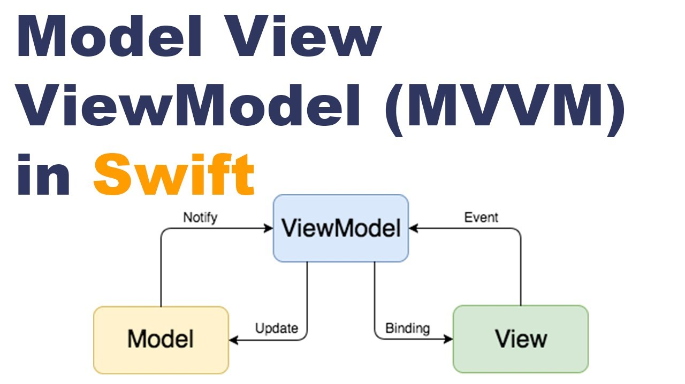

[![Swift Version][swift-image]][swift-url]
[![Build Status][travis-image]][travis-url]
[![License][license-image]][license-url]
[](https://github.com/Carthage/Carthage)
[](https://img.shields.io/cocoapods/v/LFAlertController.svg)  
[](http://cocoapods.org/pods/LFAlertController)
[](http://makeapullrequest.com)

# TestMovie

<p align="row">

</p>

## Features

- [x] List Movies in 4 tabs from API(Now Playing, Popular, Top  Rated, Upcomming)
- [x] Show Movie Detail from List
- [x] List Favorite Movies from Local Data
- [x] Search Movies by name and Overview
- [x] Save and load local Data using Core Data
- [x] Write unit test for ViewModel

## Software development princibles:

Follow by SOLID (define the protocol to init ViewController followed by MVVM structure)

## Structure:

- [x] CoreData: Folder contains Entity CoreData and class to insert, fetch and update to the local
- [x] Font: Folder of font source
- [x] Service: Networking service.
- [x] Screens: ViewController followed by MVVM.

    Model-View-ViewModel (MVVM) is a structural design pattern that separates objects into three distinct groups:

    - Models hold application data. They’re usually structs or simple classes.
    - Views display visual elements and controls on the screen. They’re typically subclasses of UIView.
    - View models transform model information into values that can be displayed on a view. They’re usually classes, so they can be passed around as references.
- [x] CustomView: Some Custom UI
- [x] Extensions: Some extensions of classes.
- [x] TestMovieTest: The Test of ViewModel
- [x] TestMovieUITests: The Test of UI

## Libraries in Pods:
[Lottie-iOS](https://github.com/airbnb/lottie-ios): Load animation from json file

[MBProgressHUD](https://github.com/jdg/MBProgressHUD): Show progress loading

[R.swift](https://github.com/mac-cain13/R.swift): Manage Resource in Swift

[SDWebImage](https://github.com/SDWebImage): Load image from URL

[Toast-Swift](https://github.com/scalessec/Toast-Swift): Make Toast notification

[IQKeyboardManagerSwift](https://github.com/hackiftekhar/IQKeyboardManager): handle keyboard events

        
## Checklist
        
- [x] 1. Design and develop the required screens using Swift and UIKit
- [x] 2. Design app's architecture (recommend VIPER or MVP, MVVM but not mandatory)
- [x] 3. Minimum iOS version should be iOS 13
- [x] 4. Use Combine Framework wherever possible / applicable
- [x] 5. Use diffable data source for table and collection views
- [x] 6. Compositional layout for collection views is a plus.
- [x] 7. Use AutoLayout. Storyboards, Xibs or programmatically created constraints is allowed
- [x] 8. Follow standard architectural patterns (preferably MVVM)
- [x] 9. Layout should be user friendly and follow Human Interface Guidelines by Apple
- [x] 10. Make sure your progress is properly conveyed through local git commit history

## Requirements

- iOS 11.0+
- Xcode 13

## Installation

#### CocoaPods
You can use [CocoaPods](http://cocoapods.org/) to install `YourLibrary` by adding it to your `Podfile`:

```ruby
platform :ios, '11.0'
use_frameworks!
pod 'YourLibrary'
```

To get the full benefits import `YourLibrary` wherever you import UIKit

``` swift
import UIKit
import YourLibrary
```
#### Carthage
Create a `Cartfile` that lists the framework and run `carthage update`. Follow the [instructions](https://github.com/Carthage/Carthage#if-youre-building-for-ios) to add `$(SRCROOT)/Carthage/Build/iOS/YourLibrary.framework` to an iOS project.

```
github "yourUsername/yourlibrary"
```
#### Manually
1. Download and drop ```YourLibrary.swift``` in your project.  
2. Congratulations!  

## Contribute

We would love you for the contribution of my code to be more clear in the future

## Meta

Your Name – [@TungPhan](https://www.facebook.com/tung.teotop/) – phanthanhtung.pt@gmail.com

[https://github.com/vuakungfuvt/TestMovie](https://github.com/vuakungfuvt/TestMovie)

[swift-image]:https://img.shields.io/badge/swift-3.0-orange.svg
[swift-url]: https://swift.org/
[license-image]: https://img.shields.io/badge/License-MIT-blue.svg
[license-url]: LICENSE
[travis-image]: https://img.shields.io/travis/dbader/node-datadog-metrics/master.svg?style=flat-square
[travis-url]: https://travis-ci.org/dbader/node-datadog-metrics
[codebeat-image]: https://codebeat.co/badges/c19b47ea-2f9d-45df-8458-b2d952fe9dad
[codebeat-url]: https://codebeat.co/projects/github-com-vsouza-awesomeios-com
